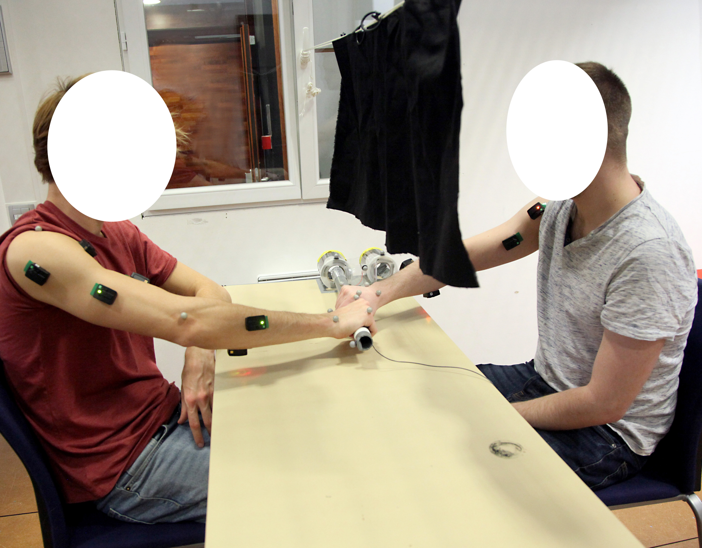

## 1) Human-human co-manipulation in collaborative and cooperative scenarios

W.Gomes, P. Maurice, S. Ivaldi (2020) “Andy Data Human Human Object Co-manipulation”.

DOI : 10.5281/zenodo.3989616.

Url: https://doi.org/10.5281/zenodo.3989616

This open-source dataset contains experimental data for two object manipulation experiments: a human dyad executing a shared co-manipulation task (20 subjects), and a human executing the same task (10 subjects). Collaborative (no fixed roles) and cooperative (fixed roles – leader/ follower) interaction data are recorded.
The collected data is comprised of kinematic data of the subjects’ arm; raw EMG signals from the subjects’ arm; and maximum value of co-contraction for each measured muscle. Additionally, there is data regarding the task performance for each dyad. These recordings were captured with a Qualisys system for motion capture, as well as Delsys EMG sensors for muscle activity signals.
